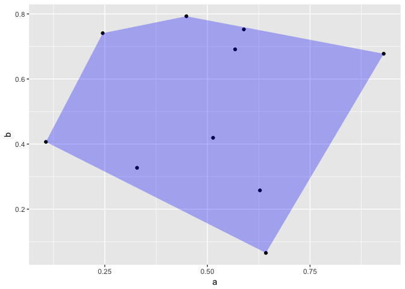

ggConvexHull : Add a convex hull geom to ggplot2
================

<!-- README.md is generated from README.Rmd. Please edit that file -->
This package adds a geom\_convexhull function, extending the geom\_polygon one.

To install :
------------

``` r
library(devtools)
devtools::install_github("cmartin/ggConvexHull")
```

Examples :
----------

The simplest case

``` r
library(ggplot2)
library(ggConvexHull)

n <- 10
test_df <- data.frame(
  a = runif(n),
  b = runif(n)
)

ggplot(test_df,aes(x = a,y = b)) +
  geom_point() +
  geom_convexhull(alpha = 0.3, fill = "blue")
```



It is especially usefull to visualize the output of ordination functions with a polygon per group, e.g.

``` r
library(vegan)
library(ggplot2)
library(ggConvexHull)

data("iris")

df <- as.data.frame(
  scores(rda(iris[,1:3]))$site
)

df$Species = iris$Species

ggplot(df,aes(x = PC1, y = PC2,col = Species)) +
  geom_convexhull(alpha = 0.3,aes(fill = Species)) + 
  geom_point() +
  theme_minimal()
```


